# 利用Cognito Group信息管理多套API Gateway+lambda环境

此文发表在AWS中国区blog中： https://aws.amazon.com/cn/blogs/china/cognito-group-api-gateway-lambda/


## 免责说明
建议测试过程中使用此方案，生产环境使用请自行考虑评估。
当您对方案需要进一步的沟通和反馈后，可以联系 nwcd_labs@nwcdcloud.cn 获得更进一步的支持。
欢迎联系参与方案共建和提交方案需求, 也欢迎在 github 项目issue中留言反馈bugs。

## 场景描述
随着目前Serverless微服务的应用越来越广泛，如何安全有效的管理多套serverless环境构建自己的应用系统逐渐成为一个大家关心的问题。
此文针对客户使用多套[API Gateway](https://aws.amazon.com/cn/api-gateway/) + [Lambda](https://aws.amazon.com/cn/lambda/)的场景，介绍了如何利用[Cognito](https://aws.amazon.com/cn/cognito/)来实现访问权限的管理与区分。Cognito用户池中不同group信息的用户可以访问不同的微服务环境。如果一个用户同时属于多个group，则当前用户可以访问多套环境。终端用户将没有权限访问自己并不属于的group的API资源。

##	架构图
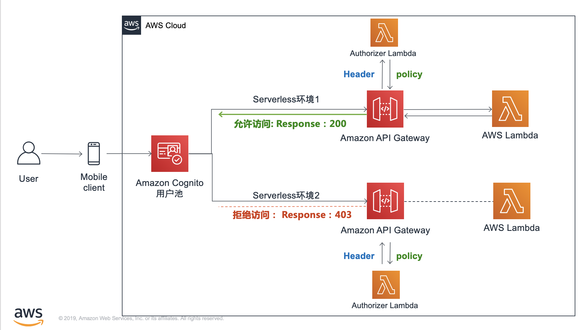


##	总述
Cognito为AWS提供的mobile端访问控制工具。利用Cognito User Pool，可以方便的实现web应用用户的注册，登录，登出等功能。Cognito提供的用户池自带多种属性可以供管理者选择，其中包括group，即组别信息。一旦拿到group的值，我们就可以利用该属性去做一些权限的判定与区分。本文利用两种方式来实现此过程，两者均利用lambda自定义Authorization来实现。每套serverless环境，需要一个API Gateway，两个lambda函数。

* 一种是前端解析cognito生成的 JWT token，将用户的cognito:group信息直接传给API Gateway，API Gateway Authorization Lambda通过对group信息的条件判断决定是否allow访问，仅允许本组成员访问本组资源，若为其他组成员，拒绝访问（您也可以将此值换成其他的attribute);

* 另一种方式是将cognito生成的JWT token传递给后端，后端通过decode解析整个token，将解析后的值来做判断，并且可以将解析后的值进一步传递给后端的lambda来做正常的业务逻辑。
两种方法对比下来，前者更为简单，而后者则更为灵活。  

有关于Cognito生成的JWT Token的更多解释，请点击[此页面](https://docs.aws.amazon.com/zh_cn/cognito/latest/developerguide/amazon-cognito-user-pools-using-tokens-verifying-a-jwt.html)

[>>>本文用到的代码点击这里获取<<<<](https://github.com/lab798/cognito-group-combined-with-serverless/)

##	步骤
#### 1. 创建cognito用户池user pool
输入user pool名称（如cognito-user-pool-for-iot），review defaults, 并根据需求做自定义修改（如可以修改necessary attributes，密码长度和字符的要求等），此demo均利用默认值。

#### 2. 创建并配置应用客户端app client
选择应用客户端，取消generate client secret的选项
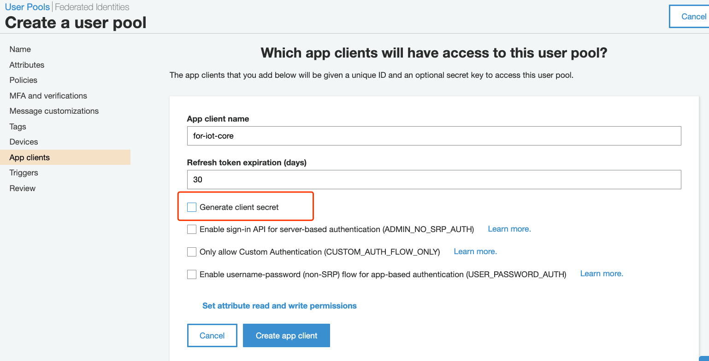

在左侧APP-Integration项目下，需要我们修改的有2个地方，一是APP client setting，修改callback URL以及scope token作用范围，二是自定义domain name（需要全region唯一）

注意：localhost:8000仅在测试环境中使用。实际生产环境，这里的callback不支持http协议，请修改为https的网址。请勿写入http://ip等形式。

记下userPoolID和app Client ID，在下一步骤中会用到。

#### 3. 搭建API Gateway资源
如果还没有API资源，新建rest-new API, 命名资源后，添加方法
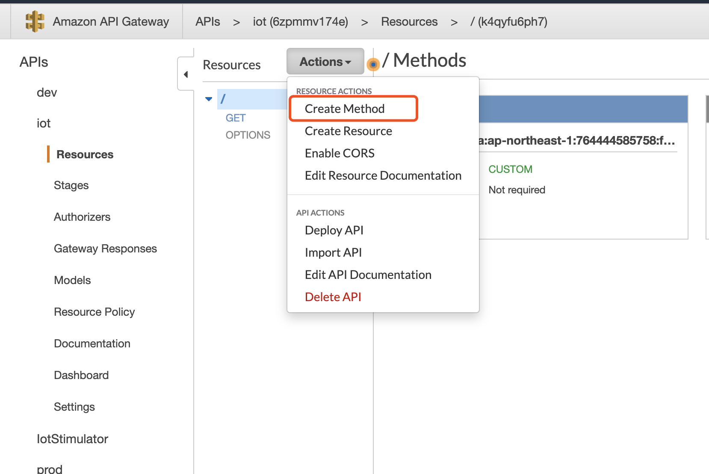

在本例当中，我们添加一个get method。点击get方法后，进入API Gateway的配置页面。
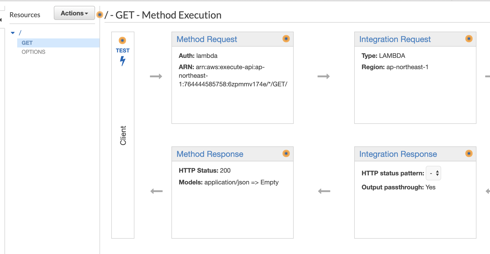

在Integration Request当中，选择intergration type为lambda，配置自己的lambda函数名
注：此lambda函数为最终执行逻辑的业务层级的lambda函数，而不是authorizer
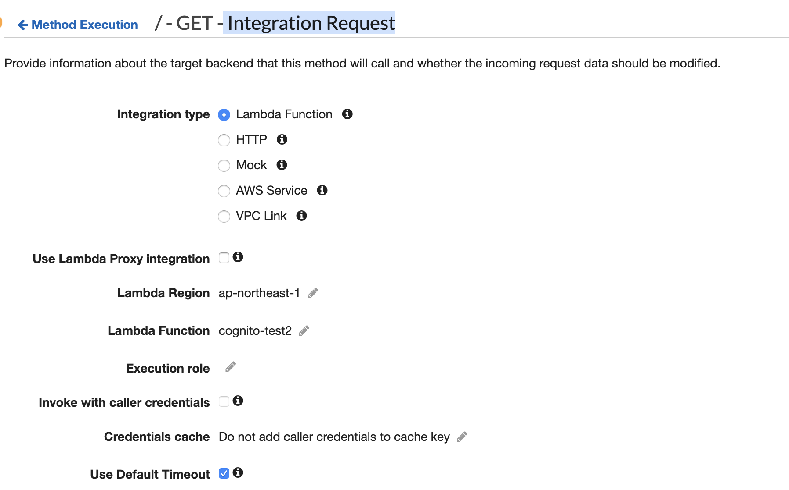

#### 4. 增加Lambda自定义认证方式
添加新的authorizer，选择用来做认证的lambda函数，event payload选择token，invoke role留空。不建议开启caching，以防止因存在缓存而出现测试结果混乱的可能。
除了token以外，事实上，API Gateway authorizer也支持用request的方式（如query string）来传递此值，本文对该话题不做进一步展开。
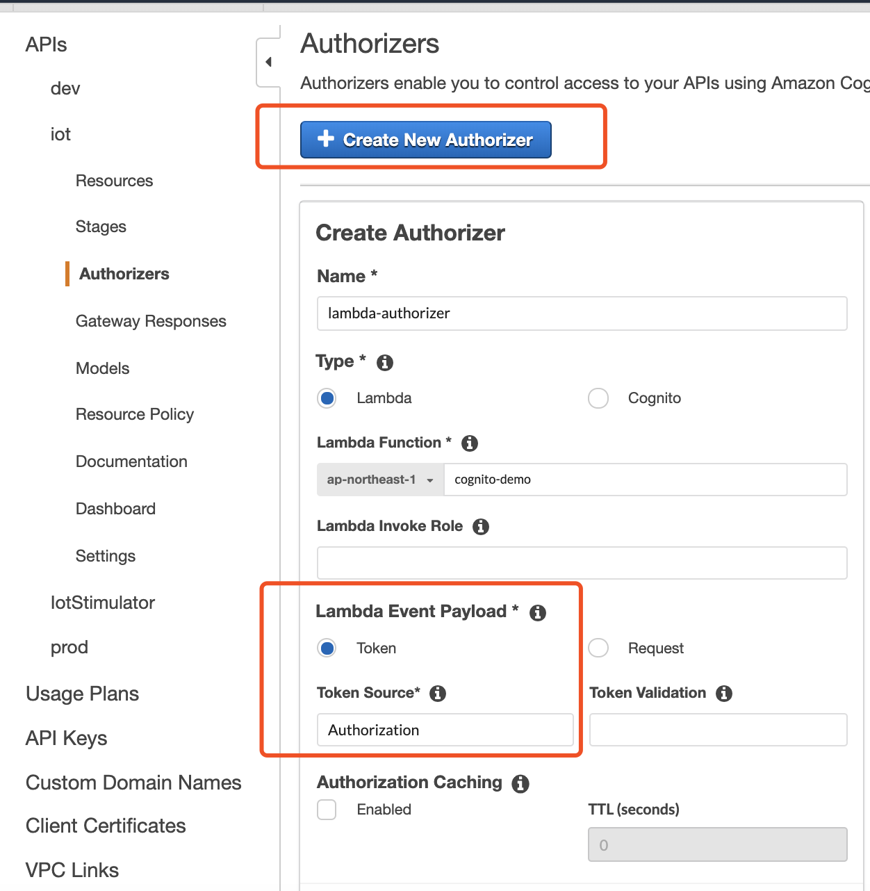

在authorizer lambda函数的设置当中，我们可以任意自定义规则。
在条件判断完毕后，允许的policy example如下：

```
allow_response = {
      "principalId": "random",
      "policyDocument": {
        "Version": "2012-10-17",
        "Statement": [
          {
            "Action": "execute-api:Invoke",
            "Effect": "Allow",
            "Resource":"<API-Gateway-method-arn>"
          }
        ]
      },
      #需要传递给后端lambda的值
      "context": {
        "key": "test",
        "numKey": 1
      }
    }
```

注意：<API-Gateway-method-arn>的完整格式为arn:aws:execute-api:{regionId}:{accountId}:{appId}/{stage}/{httpVerb}/[{resource}/[{child-resources}]].
例如arn:aws:execute-api:ap-northeast-1:1234567799:xxxxxxxx/beta/GET/(如果有resource传参接着写{resource})


deny的example policy如下：

```
  deny_response= {
    "principalId": event['authorizationToken'],
    "policyDocument": {
      "Version": "2012-10-17",
      "Statement": [
        {
          "Action": "execute-api:Invoke",
          "Effect": "deny",
          "Resource":"<API-Gateway-method-arn>"
        }
      ]
    }
  }
```

在本例当中，我们有两种方式可实现此判断，一种是直接传递解析过后的value，另外一种是传递jwt token，由authorization lambda自己做解析拿到payload。以下为具体实现。

(0)创建lambda函数
进入[lambda控制台](https://console.aws.amazon.com/lambda), 选择右上角按钮“创建函数”, 命名函数名称，选择python2.7作为语言，并且给lambda函数一个角色（role）。如果lambda函数有对AWS其他产品或服务的调用，则需确保lambda的角色有访问其他产品服务的权限，否则会报403 permission denied。有关于更多role的解释和说明，请参考[这里](https://docs.amazonaws.cn/lambda/latest/dg/lambda-intro-execution-role.html).
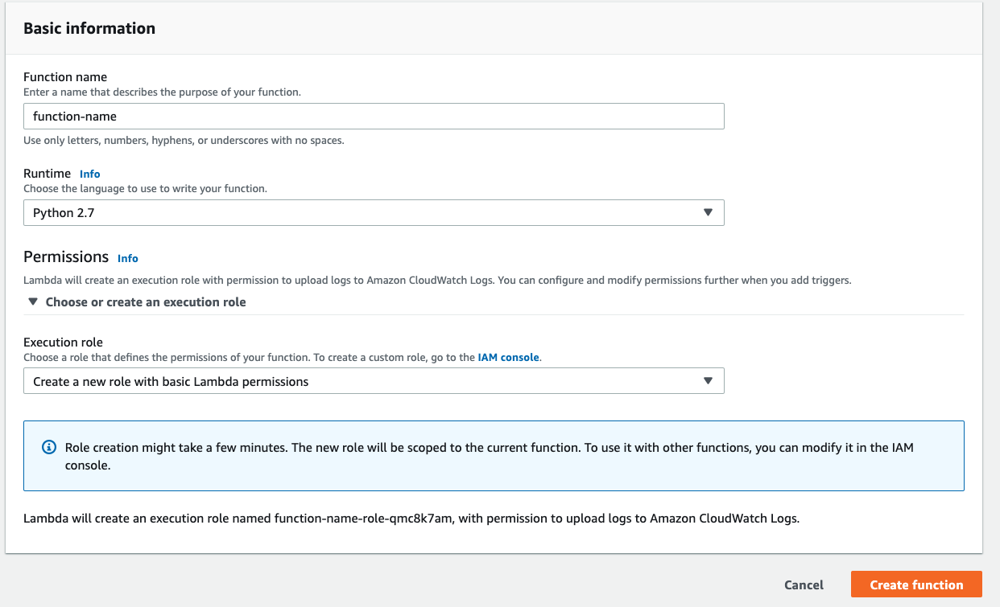

(1)我们校验前端传递过来的group信息并做判断。如果该user的group value为本组资源，则允许访问allow，否则deny.lambda python2.7参考代码如下, 也可以[点击这里下载](https://github.com/lab798/cognito-group-combined-with-serverless/blob/master/lambda.py)

```
import json

def lambda_handler(event, context):
    #获取group信息
    groups= event['authorizationToken'].split(",")
    
    #如果只属于一个group，且为本组，则允许访问
    if (len(groups) ==1):
      if (event['authorizationToken'] == 'group1'):
        response = allow_response

      #否则deny
      else:
        response = deny_response
      return response
    else:
      #如果有多个group信息，只要有一组是本组资源，允许访问；
      for group in groups:
        #print(group)
        if (group == 'group1'):
          response = allow_response
          return response
      
      #循环完毕，没有本组信息，deny
      response = deny_response          
      return response
```


配置完毕后可以点击test测试是否返回正确的policy，如
```
{
    "type":"TOKEN",
    "authorizationToken":"{caller-supplied-token}",
    "methodArn":"arn:aws:execute-api:{regionId}:{accountId}:{appId}/{stage}/{httpVerb}/[{resource}/[{child-resources}]]"
}
```

（2）前端将完整的JWT token传递给后端
cognito有三种token，分别为idToken, access Token以及refresh token。本demo当中附带的[index.html](https://github.com/lab798/cognito-group-combined-with-serverless/blob/master/index.html)通过前端的方式直观的展示了这三种token解析出来的payload。我们可以看到，idtoken与accesstoken解析出的claims包含cognito:groups，username，email等attribute。
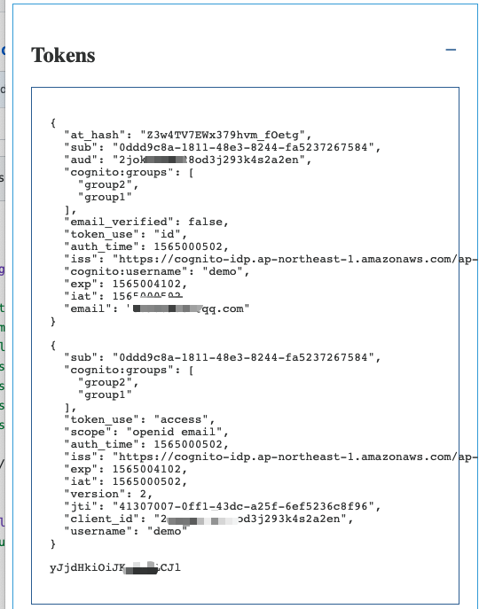

idToken与accessToken均由三个部分组成，header，payload，以及signature。格式是这样的11111111111.22222222222.33333333333
在本文当中，我们只对payload做验证。实际生产也可以增加对signature的验证。有关于signature验证的解释，请参考[这里](https://docs.aws.amazon.com/cognito/latest/developerguide/amazon-cognito-user-pools-using-tokens-verifying-a-jwt.html).

python示例如下

```
full_token=idToken.split('.')
b64_string=full_token[1]  #payload token
b64_string += "=" * ((4 - len(b64_string) % 4) % 4) #ugh
print(base64.b64decode(b64_string))  #解析后的完整json

```

这样我们就拿到了解析后的对应的json值。lambda可自行进行if逻辑判断或者传参给后端。


#### 5. enable跨域功能
在我们的demo中，我们会用localhost访问此API gateway，因此需要enable CORS否则会报跨域无法访问的错误
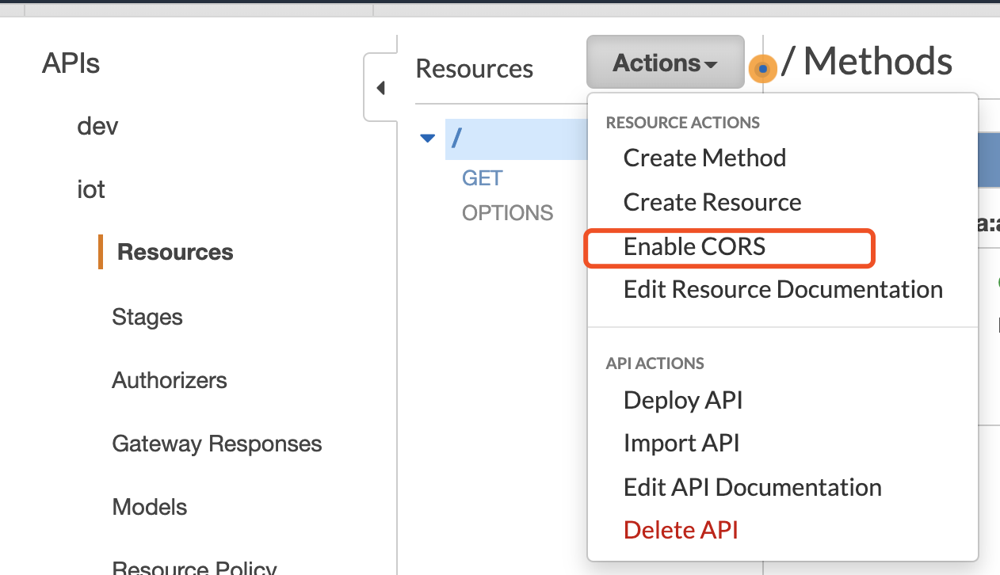

在header处添加Authorization和Access-Control-Allow-Origin标头
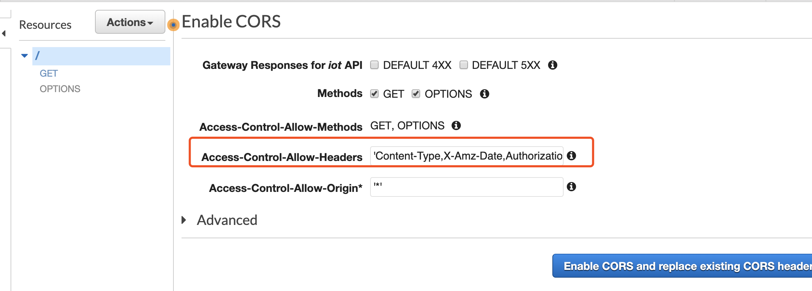


#### 6. 部署API
在以上流程没有问题后，点击部署API
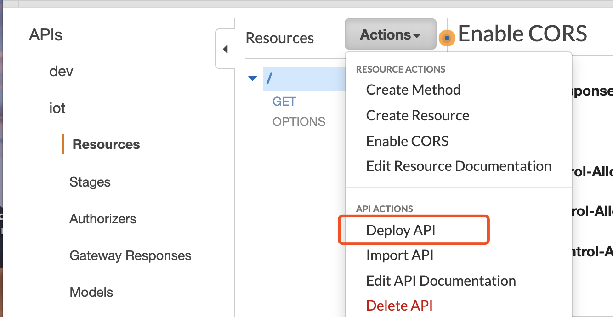

一定要注意，在每一次更新API的配置或者设置之后，一定要重新部署API，否则不会生效。

#### 7. 测试
用postman等API访问工具直接访问此get请求时，或方法（1）带authorization header但非group1信息时，方法（2）token不对时，均会显示无法访问
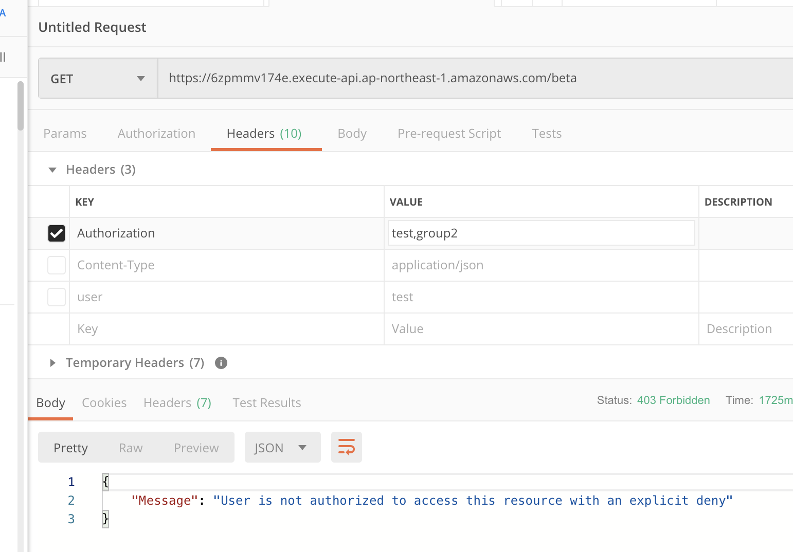
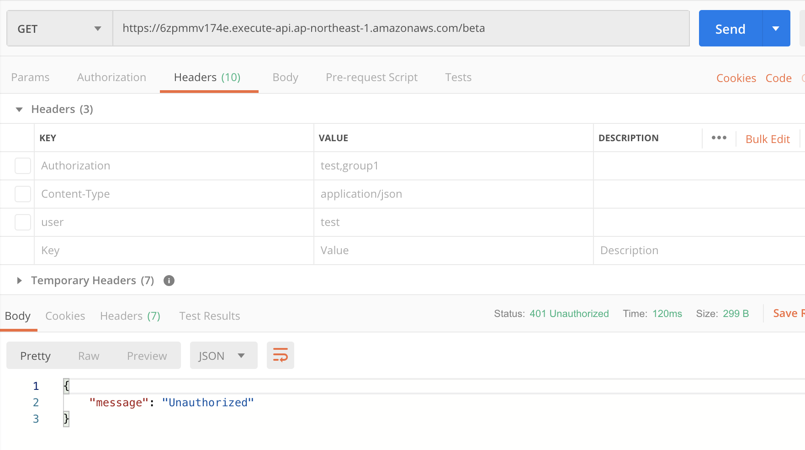

只有header带group1时，可以实现访问
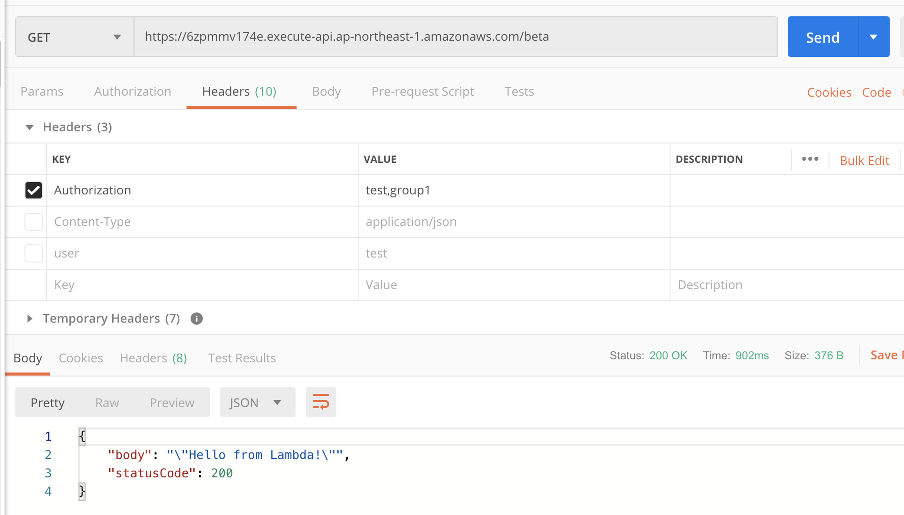


#### 8. 结合前端cognito测试
可在前端注册用户，添加group，并将用户添加到某个group当中。


cognito JS核心代码如下，在代码可以demo用户登录获取token，解析token的过程。此demo的完整代码在[这里下载](https://github.com/lab798/cognito-group-combined-with-serverless/blob/master/index.html)，有关于cognito JS更多示例以及use case，可以点击[此页面](https://docs.aws.amazon.com/zh_cn/cognito/latest/developerguide/using-amazon-cognito-user-identity-pools-javascript-examples.html)查看。

```
$.ajax({
   url: "https://xxxxx.execute-api.ap-northeast-1.amazonaws.com/beta",
   type: "GET",
   
   beforeSend: function(xhr){
    xhr.setRequestHeader('Authorization', cognito_groups)  ; 
    xhr.setRequestHeader('Access-Control-Allow-Origin','*');
   }
});
```

需要修改的字段如下：
根据两种方法的不同，为API endpoint的header当中发送的值可以是解析后的cognito_group,也可以是idtoken或是accessToken

修改cognito app client配置以及API endpoint
```
  function initCognitoSDK() {
    AWS.config.region ='ap-northeast-1';

    var authData = {
      ClientId : '<app-client-id>', // Your APP client id here
      AppWebDomain : '<your-custom-domain-name', // Exclude the "https://" part. 
      //TokenScopesArray : ['openid','email'], // like ['openid','email','phone']...
      TokenScopesArray : ['openid'], 
      RedirectUriSignIn : 'http://localhost:8000',
      //RedirectUriSignIn:"https://sdb53tv9o0.execute-api.ap-northeast-1.amazonaws.com/beta",
      RedirectUriSignOut : 'http://localhost:8000',
          UserPoolId : '<user-pool-id>', 
          AdvancedSecurityDataCollectionFlag : false
    };
    var login = {};
    var auth = new AmazonCognitoIdentity.CognitoAuth(authData);
  
    // You can also set state parameter 
    // auth.setState(<state parameter>);  
    auth.userhandler = {
       onSuccess: function (result) {
              
             //根据传递的值不同，这里可以为解析后的cognito_group,也可以是idtoken或是accessToken
             var cognito_groups=  showSignedIn(result); 
             $.ajax({
             url: "https://<API-address>/<stage>/",    //替换为自己的API Gateway endpoint
             type: "GET",
             
             beforeSend: function(xhr){
              xhr.setRequestHeader('Authorization', cognito_groups)  ; 
              xhr.setRequestHeader('Access-Control-Allow-Origin','*');
             },
             success: function(data) { 
              console.log(data); 
         }
        });

            },
            onFailure: function (err) {
              console.log('error',err);
            }
        
    };
    return auth;
  }
```

修改跳转地址
```

  function userButton(auth) {
    var state = document.getElementById('signInButton').innerHTML;
    if (state === "Sign Out") {
      document.getElementById("signInButton").href="https://<your-custom-domain-name>/logout?response_type=code&client_id=<app-client-id>&logout_uri=http://localhost:8000";
      document.getElementById("signInButton").innerHTML = "Sign In";
      auth.signOut();
      showSignedOut();

    } else {
      //session_info = auth.getSession();
      //console.log(session_info);
      document.getElementById("signInButton").href="https://<your-custom-domain-name>/login?response_type=code&client_id=<app-client-id>&redirect_uri=http://localhost:8000";

    }
  }
```
可以打开浏览器--tools--developer tools，通过console的log查看API是否调用成功，或者通过networking tab查看API的response情况（200/403）.

会发现只有当前user属于group1时，才允许访问，否则都为deny。

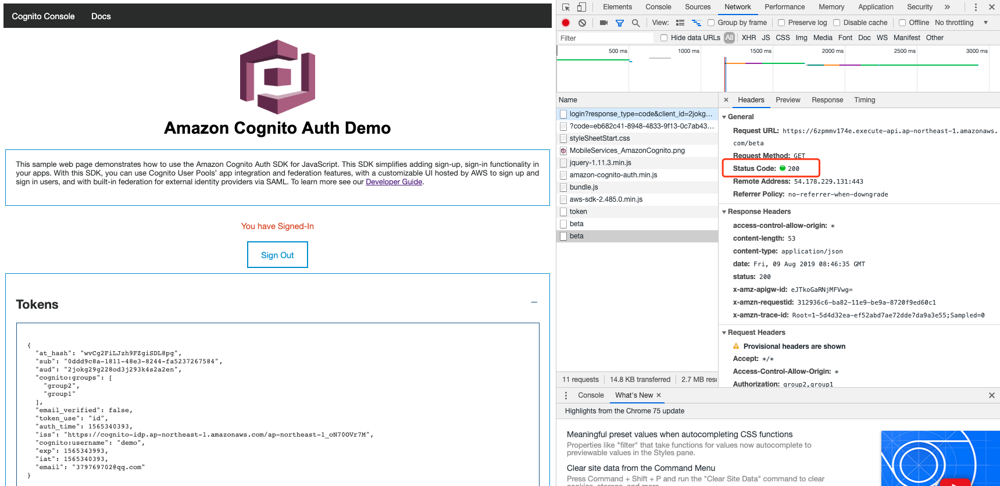


##  资源销毁

1.  删除API Gateway
1.  删除lambda函数
1.  删除cognito user pool

##	参考资料
https://aws.amazon.com/cn/blogs/compute/introducing-custom-authorizers-in-amazon-api-gateway/

https://docs.aws.amazon.com/zh_cn/cognito/latest/developerguide/using-amazon-cognito-user-identity-pools-javascript-examples.html

https://docs.aws.amazon.com/zh_cn/cognito/latest/developerguide/amazon-cognito-user-pools-using-tokens-verifying-a-jwt.html